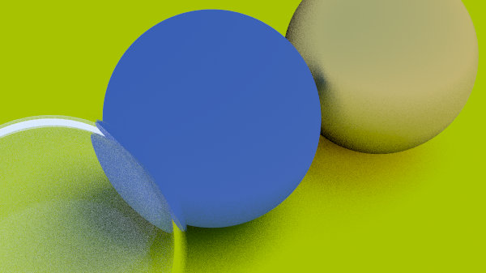

# trace-racer
A toy ray-tracer written in Python. The implementation loosely follows the
[Ray Tracing in One Weekend](https://raytracing.github.io/books/RayTracingInOneWeekend.html) series.

Below is an image of the latest render from the code:
```py
def __name__ == '__main__'
    # ...
    material_ground = Lambertian(np.array([0.8, 0.8, 0.0]))
    material_center = Lambertian(np.array([0.1, 0.2, 0.5]))
    material_left = Dielectric(1.50)
    material_bubble = Dielectric(1 / 1.50)
    material_right = Metal(np.array([0.8, 0.6, 0.2]), 0.9)

    spheres = [
        Sphere(np.array([0.0, -100.5, -1.0]), 100.0, material_ground),
        Sphere(np.array([0.0, 0.0, -1.2]), 0.5, material_center),
        Sphere(np.array([-1.0, 0.0, -1.0]), 0.5, material_left),
        Sphere(np.array([-1.0, 0.0, -1.0]), 0.45, material_bubble),
        Sphere(np.array([1.0, 0.0, -1.0]), 0.5, material_right)
    ]

    for sphere in spheres:
        world.add(sphere)

    # Camera
    Camera.aspect_ratio = 16 / 9
    Camera.image_width = 600
    Camera.samples_per_pixel = 60
    Camera.max_depth = 20


    Camera.vfov = 20
    Camera.look_from = np.array([-2.0, 2.0, 1.0])
    Camera.look_at = np.array([0.0, 0.0, -1.0])
    Camera.vup = np.array([0.0, 1.0 ,0.0])

    # ...
```
This image took 55 min to render. Given that the resolution isn't very high, and
the sampling level is quite low, this performance is disappointing but expected.
Efforts were made to ensure that as much of the code is vectorized.


### Upcoming features
1. ~~Positionable camera~~
2. ~~Blur~~, ~~field of view~~, ~~depth of field,...~~
3. Textures
4. More unit tests, and preliminary integration testing
5. Cubes and polyhedrons
6. world description language

### Resources I used along the way:
- https://docs.python-guide.org/writing/structure/
- https://docs.python-guide.org/writing/tests/
- https://docs.python.org/3/library/logging.html
- https://stackoverflow.com/questions/33189208/vs-for-a-power-of-2-operation
- https://www.youtube.com/watch?v=TrqK-atFfWY - different ways of optimising
ray tracers e.g. bounding volume, BVH, ...
- https://angms.science/doc/RM/randUnitVec.pdf - how to generate uniform unit
vectors in Rn efficiently using normal distribution sampling.