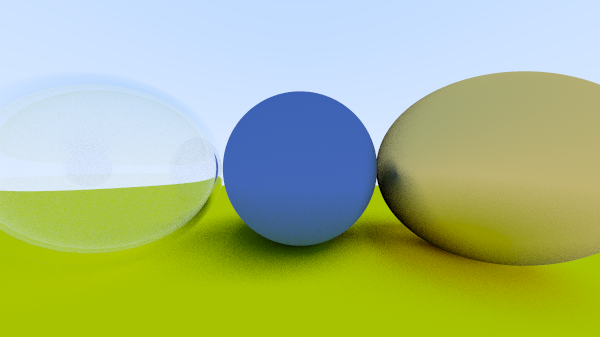

# trace-racer
A toy ray-tracer written in Python. The implementation loosely follows the [Ray Tracing in One Weekend](https://raytracing.github.io/books/RayTracingInOneWeekend.html) series.

Below is an image of the latest render from the code
```py
def __name__ == '__main__'
    # ...
    material_ground = Lambertian(np.array([0.8, 0.8, 0.0]))
    material_center = Lambertian(np.array([0.1, 0.2, 0.5]))
    material_left = Dielectric(1.50)
    material_bubble = Dielectric(1 / 1.50)
    material_right = Metal(np.array([0.8, 0.6, 0.2]), 0.9)

    world.add(Sphere(np.array([0.0, -100.5, -1.0]), 100.0, material_ground))
    world.add(Sphere(np.array([0.0, 0.0, -1.2]), 0.5, material_center))
    world.add(Sphere(np.array([-1.0, 0.0, -1.0]), 0.5, material_left))
    world.add(Sphere(np.array([-1.0, 0.0, -1.0]), 0.45, material_bubble))
    world.add(Sphere(np.array([1.0, 0.0, -1.0]), 0.5, material_right))    

    logger = Output('log')

    Camera.aspect_ratio = 16 / 9
    Camera.image_width = 400
    Camera.samples_per_pixel = 30
    Camera.max_depth = 20
    # ...
```



### Resources I used along the way:
- https://docs.python-guide.org/writing/structure/
- https://docs.python-guide.org/writing/tests/
- https://docs.python.org/3/library/logging.html
- https://stackoverflow.com/questions/33189208/vs-for-a-power-of-2-operation